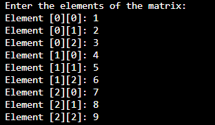

# Data Structures in C++ (BCA Coursework)

Collection of C++ programs implementing fundamental data structures from my BCA curriculum.

## Topics Covered
- 2D Matrix Operations
- (Upcoming: Linked List, Stack, Queue, Trees, Sorting Algorithms)

## 01-Matrix Operations
- Program to input a square matrix, display it, and print anti-diagonal elements.
- Technologies: C++ (console-based), 2D arrays.

**Screenshots:**

**Code:** [matrix.cpp](01-Matrix/Matrix.cpp)

## How to Run
Compile: `g++ matrix.cpp -o matrix`  
Run: `./matrix`

Developed by Zainab Fatima Haidery  
GitHub: github.com/zfhaidery
